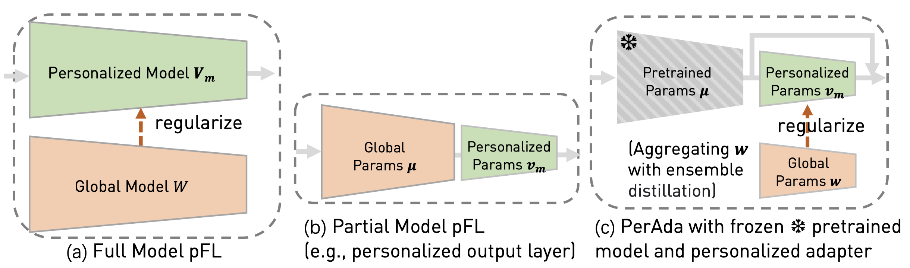
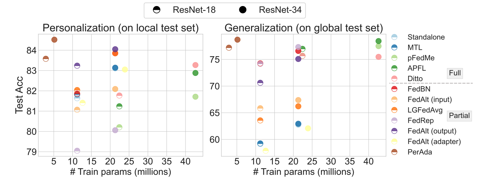

# PerAda: Parameter-Efficient Federated Learning Personalization with Generalization Guarantees

 [Chulin Xie](https://alphapav.github.io/), [De-An Huang](https://ai.stanford.edu/~dahuang/), [Wenda Chu](https://chuwd19.github.io/index.html), [Daguang Xu](https://research.nvidia.com/person/daguang-xu), [Chaowei Xiao](https://xiaocw11.github.io/), [Bo Li](https://aisecure.github.io/), [Anima Anandkumar](http://tensorlab.cms.caltech.edu/users/anima/)

[[`CVPR 2024`](https://arxiv.org/abs/2302.06637)] [[`BibTeX`](#Citation)]

## Contents
- [Introduction](#introduction)
- [Install](#install)
- [Dataset](#dataset)
- [Train](#train)
- [Evaluation](#evaluation)

## Introduction
This repository contains the code for our CVPR'24 paper [PerAda: Parameter-Efficient Federated Learning Personalization with Generalization Guarantees](https://arxiv.org/abs/2302.06637). 
Personalized Federated Learning (pFL) has emerged as a promising solution to tackle data heterogeneity across clients in FL. However, existing pFL methods either (1) introduce high computation and communication costs or (2) overfit to local data, which can be limited in scope and vulnerable to evolved test samples with natural distribution shifts. 

In this paper, we propose PerAda, a parameter-efficient pFL framework that reduces communication and computational costs and exhibits superior generalization performance, especially under test-time distribution shifts. PerAda reduces the costs by leveraging the power of pretrained models and only updates and communicates a small number of additional parameters from adapters. PerAda achieves high generalization by regularizing each client's personalized adapter with a global adapter, while the global adapter uses knowledge distillation to aggregate generalized information from all clients. 

 

Theoretically, we provide generalization bounds of PerAda, and we prove its convergence to stationary points under non-convex settings. Empirically, PerAda demonstrates higher personalized performance (+4.85% on CheXpert) and enables better out-of-distribution generalization (+5.23% on CIFAR-10-C) on different datasets across natural and medical domains compared with baselines, while only updating 12.6% of parameters per model on ResNet-18.

## Install

1. Create a conda environment:

    ```bash
    conda create -n perada python=3.8
    conda activate perada
    conda install pytorch==1.12.0 torchvision==0.13.0 cudatoolkit=11.3 -c pytorch
    ```

    Alternatively, use the docker image `nvidia/pytorch:22.05-py3`.

2. Install additional packages:

    ```bash
    pip install -r requirements.txt
    ```


## Dataset

See [Datasets Preparation](data/README.md).

*Important note: Each user is responsible for checking the content of datasets and the applicable licenses and determining if suitable for the intended use and applicable links before the script runs and the data is placed in the user machine.*

## Train

Take CIFAR-10 dataset as an example. 
Run PerAda without knowledge distillation:

```Shell
export CUDA_VISIBLE_DEVICES=0
sh scripts/cifar10/perada-nokd.sh
```

Run PerAda with knowledge distillation:
```Shell
sh scripts/cifar10/perada-kd.sh
```

Run FedAvg baseline:
```Shell
sh scripts/cifar10/fedavg.sh
```
Run Standalone baseline:
```Shell
sh scripts/cifar10/standalone.sh
```

For other experiments, replace `cifar10` with `oh` or `chexpert` in the above commands.


## Evaluation

We provide the evaluation pipeline by testing the personalized models on local test sets, global test sets, or out-of-distribution test sets.

Take CIFAR-10 dataset as example. 
Run: 
```Shell
sh scripts/cifar10/inf.sh
```
Update the `model_paths` in the above script for your trained models.


For other experiments, replace `cifar10` with `oh` or `chexpert` in the above commands.


## License

Copyright © 2024, NVIDIA Corporation. All rights reserved.

This work is made available under the Nvidia Source Code License-NC. Click [here](LICENSE) to view a copy of this license.


For business inquiries, please visit our website and submit the form: [NVIDIA Research Licensing](https://www.nvidia.com/en-us/research/inquiries/).


## <a name="Citation"></a> Citation

If you find this work useful for your research and applications, please cite using this BibTeX:
```bibtex
@inproceedings{xie2024perada,
  title={PerAda: Parameter-Efficient Federated Learning Personalization with Generalization Guarantees},
  author={Xie, Chulin and Huang, De-An and Chu, Wenda and Xu, Daguang and Xiao, Chaowei and Li, Bo and Anandkumar, Anima},
  booktitle={Proceedings of the IEEE/CVF Conference on Computer Vision and Pattern Recognition},
  pages={23838--23848},
  year={2024}
}
```


## Acknowledgement

- [FL_partial_personalization](https://github.com/facebookresearch/FL_partial_personalization) for adapter implementation
